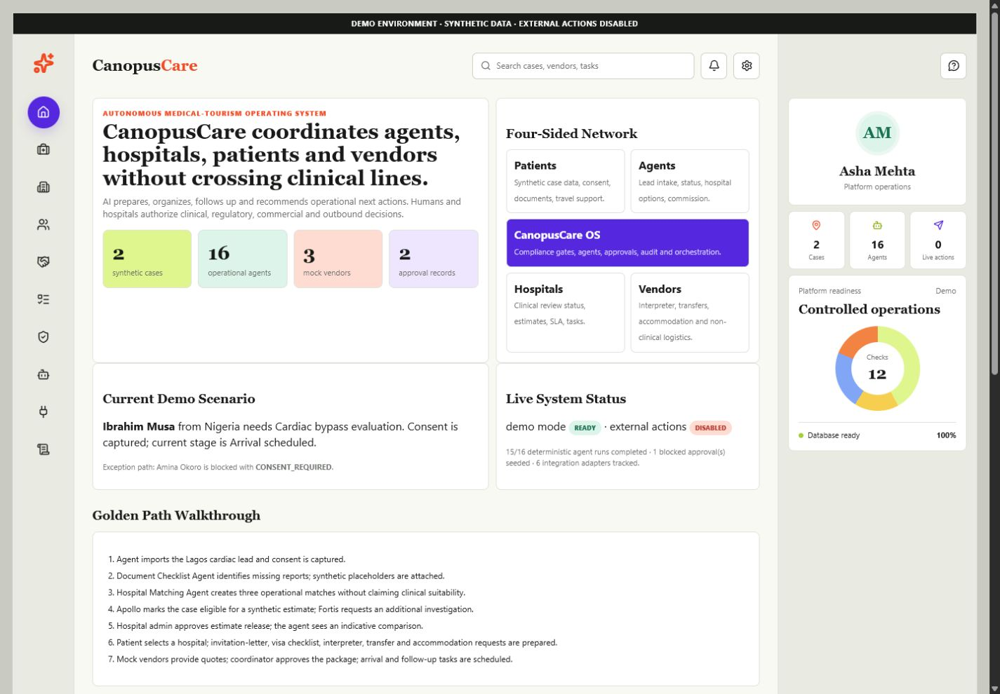
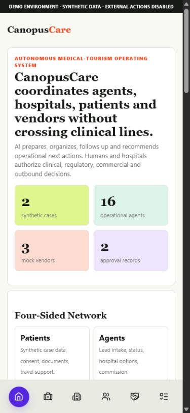

# Canopus Care

[](https://github.com/hussainbombaywala/medical-tourism-gtm/actions/workflows/ci.yml)

Canopus Care automates the administrative work required to move an international
patient case from a medical-travel agent to an Indian hospital.

AI prepares and coordinates administrative work. Hospitals retain clinical
decisions, and humans approve sensitive actions.

[Public demo: deployment pending](./DEPLOYMENT.md) |
[Product demo video: pending](./DEMO_SCRIPT.md) |
[YC reviewer guide](./docs/YC_REVIEWER_GUIDE.md)

The repository name is a legacy identifier. The working product name is
**Canopus Care**.

## Run Locally

Requires Node 22.5 or newer.

```bash
cp .env.example .env
docker compose up --build
```

Open [http://localhost:5173/demo](http://localhost:5173/demo).

The equivalent Node path is:

```bash
cp .env.example .env
npm ci
npm run yc-demo
```

Default local reviewer credentials:

```text
Username: reviewer@canopuscare.com
Password: canopus-demo
```

Public deployments must override the role passwords through `DEMO_AGENT_PASSWORD`,
`DEMO_HOSPITAL_PASSWORD` and `DEMO_REVIEWER_PASSWORD`. Passwords remain server-side.

> The demo contains synthetic patients, documents, hospital responses,
> estimates, and vendor quotations. External messages, payments, bookings,
> visa filing, and clinical decisions are mocked or disabled. Do not enter
> real medical records.

## Product Walkthrough





The primary path starts at `/demo`:

1. Open the synthetic Nigerian cardiac case.
2. Review consent and the missing-document checklist.
3. Compare three fictional operational hospital matches.
4. Inspect the hospital response and indicative estimate.
5. Review the human approval record.
6. Inspect mock interpreter, transfer, and accommodation requests.
7. Open `/agents` for deterministic agent activity.
8. Open the consent-blocked case and verify the refusal.

Use [DEMO_SCRIPT.md](./DEMO_SCRIPT.md) for the 75-second presentation.

## Main Surfaces

| Route | Purpose | Access |
|---|---|---|
| `/demo` | Reviewer control panel | Public, read-only by default |
| `/login` | Signed reviewer session | Public |
| `/agent` | Source-agent case view | Public synthetic view; role-scoped after login |
| `/hospital` | Hospital operations view | Public synthetic view; role-scoped after login |
| `/cases` | Operational case list | Public synthetic view |
| `/cases/case_ibrahim_musa` | Golden synthetic case | Public synthetic view |
| `/vendors` | Mock non-clinical coordination | Public synthetic view |
| `/agents` | Deterministic agent activity | Public synthetic view |
| `/readiness` | Real, mocked, and disabled components | Public |
| `/audit` | Synthetic audit history | Public |
| `/console` | Legacy GTM/contact pipeline | `CONSOLE_TOKEN` |
| `/studio` | Operator approval surface | `CONSOLE_TOKEN` |
| `/sandbox` | Editable legacy journey simulator | `CONSOLE_TOKEN` |

Anonymous demo visitors receive the `read_only` role. Demo role accounts use a
signed, expiring, HttpOnly session cookie. The `x-demo-user` test shortcut is
ignored outside `APP_MODE=demo`.

## Architecture

```text
Browser
  |
  v
Zero-dependency Node HTTP server
  |-- signed reviewer sessions and role scope
  |-- public synthetic OS routes
  |-- gated GTM/operator routes
  |-- human approval and consent gates
  |
  v
SQLite data core
  |-- lead and operational-case projection
  |-- deterministic synthetic seed
  |-- estimates, vendors, tasks, approvals, audit
  |-- agent-run evidence
```

The HTTP server and SQLite core boot without `node_modules`. `puppeteer-core`
is optional and used only for explicitly requested browser-generated assets.
See [ARCHITECTURE.md](./ARCHITECTURE.md) and
[docs/DATA_MODEL.md](./docs/DATA_MODEL.md).

## Data Safety

- Demo mode accepts synthetic data only.
- Real uploads, outbound messaging, booking, payments, and social publishing
  are disabled.
- No message is sent unless `POST_LIVE=1` and its per-item human approval passes.
- The company is a facilitator, not a medical provider.
- Hospitals retain every clinical decision.
- AE, UZ, KZ, and ZM remain blocked by the compliance skip list.
- Demo hospital names are fictional and imply no partnership.
- Commission is a hospital-paid, illustrative engine-derived facilitation share,
  not a patient markup.

See [docs/WHAT_IS_REAL.md](./docs/WHAT_IS_REAL.md),
[SECURITY.md](./SECURITY.md), and [COMPLIANCE.md](./COMPLIANCE.md).

## Database Commands

```bash
npm run db:migrate
npm run db:seed
npm run db:check
npm run db:backup
npm run db:reset-demo
```

`db:seed` seeds only a missing database. Existing state is preserved.
`RESET_DEMO=1 npm run db:seed` performs a deliberate demo-only reset after
creating a backup. Production mode never seeds synthetic demo data.

The default copied `.env` stores runtime data under `./data/`, outside source
files. The legacy `data-core/medyatra.db` default remains supported for
migration compatibility.

## Tests

```bash
npm run env:check
npm run check
npm run test:unit
npm run test:integration
npm run test:e2e
npm run smoke:hermetic
npm run smoke-agents
npm run smoke-vault
```

The main suite covers signed sessions, role scope, public/operator access,
production demo-user fencing, deterministic first boot, consent blocking,
commission consistency, case projection, vendor lifecycle, and live server
smoke behavior.

Docker commands:

```bash
npm run docker:build
docker compose up --build
```

## Deployment

`render.yaml` defines a Docker deployment with:

- `APP_MODE=demo`
- `POST_LIVE=0`
- a persistent `/var/data` disk
- generated session, console, and encryption secrets
- first-boot-only deterministic seeding
- `/api/readiness` health checks

Follow [DEPLOYMENT.md](./DEPLOYMENT.md). A public URL is not claimed until it
has been deployed and verified in an incognito session.

## What Is Real, Mocked, and Disabled

The complete, maintained inventory is in
[docs/WHAT_IS_REAL.md](./docs/WHAT_IS_REAL.md) and is visible at `/readiness`.

## Known Limitations

- The public Render deployment still requires an account owner to create or
  approve the service and configure the deployment-owned demo password.
- Docker could not be executed in the current Windows audit environment because
  Docker is not installed; CI performs the Docker build.
- Production identity, encrypted object storage, monitoring, backups, legal
  agreements, and external security testing are required before real patient or
  vendor use.
- WhatsApp, email, social, payments, and booking providers remain unconfigured.
- Telegram-first markets remain an acknowledged integration gap.

## Repository Map

| Path | Purpose |
|---|---|
| `agent-os/` | Build loop, queue, evidence, and stop rules |
| `build-os/` | Product, market, compliance, and acceptance contracts |
| `data-core/` | SQLite schema, migrations, seed, GTM, and OS data logic |
| `server/` | HTTP routes, sessions, OS pages, operator surfaces, agents |
| `lib/` | Safety, integrations, model routing, and deterministic helpers |
| `scripts/` | Startup, validation, health, smoke, and operations commands |
| `tests/` | Unit, integration, live-server, and rendered-page tests |
| `docs/` | Reviewer, data model, deployment, and readiness documentation |
