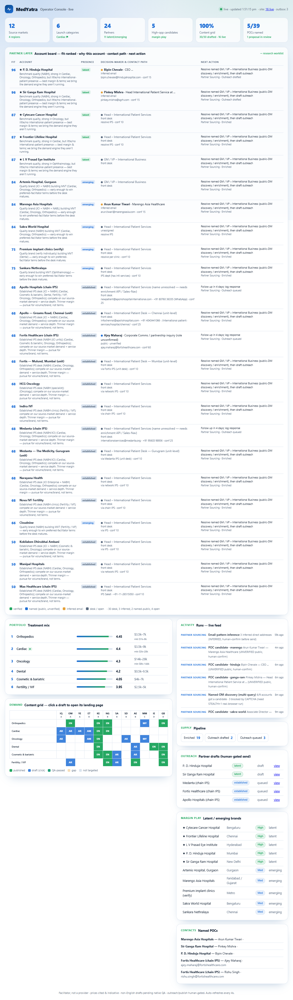

# MedYatra — an agentic Go-To-Market engine

An **autonomous, multi-agent go-to-market engine** for a medical-tourism *facilitator* launching in India — and re-tailorable to any market. It decides what to sell, builds the hospital-partner supply side (down to the named decision-maker and a tailored proposal), runs a multilingual content/brand campaign, turns each page into platform-ready social posts with real infographics and stock photos, and shows all of it moving on a live operator console — continuing on a schedule even when Claude is offline.

> Built as a demonstration of end-to-end **AI product engineering**: multi-agent orchestration, a cost-tiered multi-model factory with cross-provider failover, browser automation that gets past what APIs can't, a pluggable integration layer (image gen, social posting, enrichment — each one env-key away), a zero-dependency data core, and a real-time UI — with an honest compliance posture throughout.



---

## What it actually does

| # | Capability | How it's real (not a mock) |
|---|---|---|
| 1 | **Decides what to sell** | Weighted scoring model ranks 6 medical categories on cost-arbitrage, quality, ease, demand, margin, whitespace — plus a **bundleable wellness/naturopathy line** sold standalone (lowest-friction, cash-pay) or as a post-op recovery add-on. Prices are cross-checked against live competitor pages (Vaidam/MediGence) via browser scraping. *(Ophthalmology was evaluated and dropped — low-ticket, follow-up-heavy, better delivered locally; see `build-os/03`.)* |
| 2 | **Builds the partner supply side** | Hospital partners tiered by a *"does this partner need us?"* fit score (the margin thesis: high quality × low current international presence), plus naturopathy-resort **wellness supply** (Jindal, Kshemavana, Soukya…). Finds the **named** decision-maker (Head–International Patient Services) via stealth Google→LinkedIn, infers their email, and tracks each account through a pipeline with a next action. |
| 3 | **Builds the demand side** | 30 cornerstone cost-guide pages generated across 6 categories × target markets × 4 languages (EN/AR/AM/MY), QA-gated for cited prices + disclaimers, published to a static site. |
| 4 | **Distributes it** | Each page is repurposed into platform-native posts (LinkedIn / Instagram / Reddit / WhatsApp / X). Visuals pick the right source per slide: **data infographics** (real numbers, crisp text), **stock photos** for people, AI only for abstract graphics. Human-gated at post. |
| 5 | **Globalizes** | Every artifact is market-parameterized (config, not code) across the Middle East, Africa, Central Asia, Europe, SE Asia. |
| 6 | **Runs itself** | A scheduled task drives the whole factory **without Claude** (generation fails over across providers); a live console renders the account board, content heatmap, competitor pricing, a plugin-readiness board, and a real-time run feed. |
| 7 | **Sells & onboards patients** | A **dual-mode funnel**: leads enter from the engine's *own acquisition* **or** an *external lead DB plugged in* by a partner operator (`POST /api/lead/ingest` — normalises, masks PII, dedupes, tags `source_type`). A WhatsApp sales-comms **state machine** — template/session-aware, with a **diagnosis fork** and explicit **hospital handoffs** — drives first touch → booked patient. Everything is approved in **MedYatra Studio** (`/studio`), a live approve-and-deploy console that writes back to the DB. The whole journey is demoable in a **deployment-ready sandbox** (`/sandbox`): a WhatsApp phone simulator plays every branch, and all 21 templates are **clickable + editable live** (human-gated — an edit routes back to *review* before it can send), with a white-label tenant switch for showing an operator their own front. |
| 8 | **Runs the concierge, post-booking** | **Nine live agents** at **`/agents`** turn "booked" into "actually treated": triage (patient's own words → the structured case file a hospital reviews in three minutes), a family-update channel with its own consent + WhatsApp session rule, a stateful document-KYC workflow (one deterministic rule auto-verifies, the rest stay `needs_human_review` until a person clears them), DB-backed billing reconciliation, a discharge/medication relay that only ever relays the hospital's own words, ground logistics, interpreter scheduling, return-travel readiness, and payment routing (self-pay / insured-GOP / government-sponsored). Every agent clears the same safety gate as every other outbound message; three are deliberately deterministic, never LLM-generated, because a wrong answer on a visa rule, a dose, or a sum of money is worse than no answer. |
| 9 | **Prices honestly** | A **price ladder** (`priceLadder()`, `data-core/db.mjs`) compares a reader's *best local option* first, then other international destinations, then India — never a US/UK strawman a patient never asked about. Unpriced rungs are explicit, visible research gaps, never guessed (`npm run price-gaps`). Content is written to a **demand driver** — *capability* (can't get it at home), *queue* (available but too slow), or *cost* (available but unaffordable) — because those are three different readers, not one. |
| 10 | **Won't let an agent say something dangerous** | Every outbound message clears `lib/safety.mjs` before it can reach a human's approval queue: diagnosis, treatment advice, dosage, prognosis, fitness-to-fly and outcome guarantees are **blocked**; an emergency in the patient's own words **escalates** out of the funnel to local emergency care; PII is blocked from leaving the patient perimeter; data residency is enforced per source market (the UAE's Federal Law 2/2019 is the sharp edge — health data can't leave the country, including into a model prompt). A language with no native-validated coverage **fails closed** rather than silently passing. Verified by a 20-case adversarial suite (`npm run eval-safety`) that runs in CI on every push. |

## Architecture — a cost-tiered multi-model factory

```
  Tier 1  Orchestrator / QA / compliance      (Claude — strategy, guardrails, final sign-off)
     │
     ▼
  Tier 2  Bulk generation                      Cross-provider failover chain:
     │      content, proposals, outreach          GLM-5.2 → Gemini 2.5-flash  (NIM gets a short
     ▼                                             probe budget → fast failover; first responder wins;
                                                   survives model outages
  Tier 3  Narrow patches (meta, classify)         AND Claude hitting its usage limit)
     │
     ▼
  Plugin layer (each one env-key away)  ── image gen (Cloudflare FLUX free · Gemini · OpenAI · Stability)
     │                                   ── infographics (HTML→PNG) · stock photos (Pexels/Openverse)
     │                                   ── social posting (Meta · LinkedIn · X · Reddit · WhatsApp)
     ▼                                   ── enrichment · email — all dry-run/human-gated until keyed
  Free/local execution layer  ── SQLite data core (node:sqlite, zero deps)
                              ── Browser automation (puppeteer-core → local Edge; stealth mode)
                              ── Free web research · local .eml outbox · static-site generator
                              ── Zero-dep HTTP server + live console + scheduled factory loop
```

The processing loop runs at **~$0 marginal cost**: generation is on free tiers and fails over across providers, images/infographics/stock are free, and the only optional paid calls (premium image models, enrichment, real posting) are behind env keys, off by default. See the live **plugin-readiness board** at `/plugins`.

## Quickstart

Requires **Node ≥ 22.5** (for the built-in `node:sqlite`).

```bash
npm install                 # only dependency: puppeteer-core (drives your local Edge/Chrome)
cp integrations/.env.example integrations/.env   # add NVIDIA NIM and/or Gemini key (Gemini carries generation when GLM is unserved)
npm run demo                # ONE COMMAND: rebuild the whole showable demo (data + tenants + leads + templates + published guides + distribution)
npm run serve               # → http://localhost:5173  (open /demo)
```

> `npm run demo` reproduces the full populated state on any machine from committed files — **no API keys required** (the optional social-repurpose step runs only if a generation key is present). For the minimal core, `npm run seed` still just builds the data core.

**Showing someone the engine? Open [`/demo`](http://localhost:5173/demo)** — one page linking every capability
(with live counts), framed as a safe sandbox. Three stops matter most: the **[patient-journey sandbox](http://localhost:5173/sandbox)**
(a WhatsApp phone simulator playing every branch, templates editable live), the **[concierge agents](http://localhost:5173/agents)**
(click Run on any of the thirteen — every response is a real model call through the real safety gate, not a transcript),
and the **[full journey orchestrator](http://localhost:5173/journey)** (one real lead through all thirteen agents,
in the real chronological order, in a single run — the same handlers `/agents` uses, not a separate demo path).
Going live from here is just plugging in keys — see [`build-os/12_GO_LIVE.md`](./build-os/12_GO_LIVE.md) (which
features need which keys) and [`build-os/13_DEPLOYMENT.md`](./build-os/13_DEPLOYMENT.md) (where the process
actually runs and what it costs — SQLite + Litestream, not a managed Postgres, for roughly $5–10/month).

Then explore the engine:

```bash
npm run query portfolio     # ranked treatment categories with scores
npm run partner-layer       # rebuild the fit-ranked account board
npm run worklist            # generate the human research worklist (/worklist)
STEALTH=1 npm run discover  # find named decision-makers via Google→LinkedIn (real browser)
npm run loop                # one unattended factory cycle (runs without Claude)
npm run auto-loop -- gen_doctor_outreach.mjs   # keep retrying a generation script when a rate limit clears — no human needed to re-run it
npm run economics           # unit economics: cost to acquire + fulfil one treated patient, cited vs assumed
npm run eval-safety         # the adversarial safety suite (20 cases; also runs in CI)
npm run smoke-agents        # headless check across all 12 concierge agents' pure functions (21 assertions)
```

## What's honest about it

This is a **first-draft engine**, and it says so where it matters:

- **No fabrication.** Prices are cited or marked indicative; discovered contacts are stored **UNVERIFIED** for human confirmation; the engine is a *facilitator*, never a provider, and makes no clinical claims.
- **Real walls, honestly handled — including the legal one.** Named decision-makers live behind forms and Sales-Nav. The **compliant** path is a licensed enrichment API (used first when keyed). The stealth-browser fallback is **off by default and opt-in** (`ALLOW_SCRAPE=1`) because defeating anti-bot detection can violate a service's ToS *regardless of the data being public* — with a **CAPTCHA circuit-breaker** that backs off when the IP is flagged and falls to a human worklist. No pretending scraping is "clean." (See [`build-os/10`](./build-os/10_SECURITY_COMPLIANCE.md).)
- **Human gates** on everything outbound: publishing pages, sending outreach, and any commercial term.
- **Guardrails are enforced, not requested.** Every outbound message clears `lib/safety.mjs` in code, not by asking a model nicely — verified by an adversarial test suite (`npm run eval-safety`) that runs in CI and has already caught a real regression (a verdict reducer that silently returned "pass" while holding blocking findings).
- **Privacy-respecting repo.** Individual contact data lives only in the local gitignored database — the published repo ships institutional/public data only.

## Repo map

| Path | What's there |
|---|---|
| [`agent-os/`](./agent-os/) | *How* the agents loop, route models, QA, and stop — plus the live task queue and evidence log |
| [`build-os/`](./build-os/) | *What* to build + the actual GTM strategy, data sources, compliance, acceptance tests |
| [`data-core/`](./data-core/) | SQLite schema + seed + every agent script (scoring, sourcing, discovery, content, QA, publish, repurpose, proposals, credibility, run-loop) |
| [`server/`](./server/) | Zero-dep HTTP server, live operator console, **`/studio`** (live approve-and-deploy, writes back to the DB), **`/sandbox`** (editable patient-journey demo), **`/agents`** (the thirteen concierge agents, live), **`/vault`** (medical-data architecture status), patient landing, `/comms`, `/plugins`, `/distribution`, `/worklist` |
| [`lib/`](./lib/) | Browser automation, research, enrichment, mailer, image gen, infographics, stock, media router, social publishers, plugin registry, env loader, `safety.mjs` (the clinical/PII/residency guardrail), `eeat.mjs` (content trust signals), `visa.mjs` + `stay.mjs` + `flights.mjs` (visa documents, accommodation, flexible-date ticketing — all provider-agnostic) |
| [`lib/agents/`](./lib/agents/) | Ten of the thirteen concierge agents: triage, family-update + family-channel, document-kyc, billing-reconciliation, discharge-relay, ground-logistics, interpreter-scheduling, travel-readiness, payment-routing, video-consult (visa, accommodation + ticketing live in `lib/` directly — see above) |
| [`integrations/`](./integrations/) | Cross-provider LLM failover helper (+ Gemini) + LiteLLM config |
| [`scripts/`](./scripts/) | `run_factory.bat` — the scheduled unattended factory loop |
| [`deploy/`](./deploy/) | Reference deployment kit (Dockerfile, Fly.io config, Litestream config) — not yet deployed, see `build-os/13` |
| [`outputs/`](./outputs/) | Generated content, social posts + visuals, proposals (gitignored), worklist, screenshots |

**Want to run it?** See [`USER_GUIDE.md`](./USER_GUIDE.md) — step-by-step setup, the demo path, how to use every surface, the daily approval loop, and troubleshooting.

**Want the deep version?** See [`PROJECT_CONTEXT.md`](./PROJECT_CONTEXT.md) — a full walkthrough of every capability, design decision, nuance, and limitation.

**Want the business version?** See [`BUSINESS_STATUS.md`](./BUSINESS_STATUS.md) — market, unit economics (with every input labelled cited or assumed), partnership status, and an honest risk register. Written for a partner or investor conversation, not an engineer.
